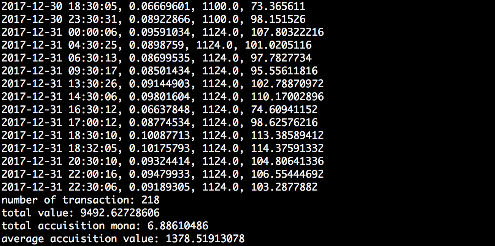

## 概要
2017年にマイニングで得たモナコインの確定申告のための取得価格を計算するスクリプトです。
温水プール用に作りましたが、vippool等のMPOSベースのAPIに互換があるプールなら動作するはずです。
APIから全てのトランザクションを取得し、取得した日の終値をかけて、マイニング時の取得金額を算出します。

## 環境
* python3
* pip
    * requests
    * pandas

python2系の方は、masterブランチをご利用ください。
https://github.com/bohemian916/mona_pool_mining_value
	
## 使い方
pool.iniというファイルに使っているプール情報を入力します。
プールのurlと、API KEYを設定してください。

例
```pool.ini
[info]
pool_url=https://onsui-monacoin.xyz
api_key=12345678901234567890123456789012345678901234567890
```

API KEYは個人のアカウント設定ページで確認できます。他者に知られないように気をつけてください。

設定後、実行します。
pandasとrequestsが必要なので、pipでインストールしておきます。

```
$ pip install requests pandas
```

実行は 

```
$ python main.py
```

トランザクション数、取得価値総額、取得モナ数、平均取得価格を表示します。



また、output.csvというファイルに詳細が出力されます。

## マイニング時の所得計算について
以下の方針を参考にしています。

```
９ 仮想通貨のマイニング等
問 仮想通貨をマイニングにより取得した際の所得の計算方法を教えてください。

答 いわゆる「マイニング」（採掘）などにより仮想通貨を取得した場合、その所得
は、事業所得又は雑所得の対象となります。
この場合の所得金額は、収入金額（マイニング等により取得した仮想通貨の取
得時点での時価）から、必要経費（マイニング等に要した費用）を差し引いて計算
します。
なお、マイニング等により取得した仮想通貨を売却又は使用した場合の所得計
算における取得価額は、仮想通貨をマイニング等により取得した時点での時価と
なります。
```

http://www.nta.go.jp/shiraberu/zeiho-kaishaku/joho-zeikaishaku/shotoku/shinkoku/171127/01.pdf

取得時刻での価値を厳密に取得することが難しいので、取得したその日の終値で計算しています。

## モナコインの価格の取得方法
Zaifからダウンロードできる日足のmana/jpyのcsvを利用しています。
https://zaif.jp/download_trade_price


